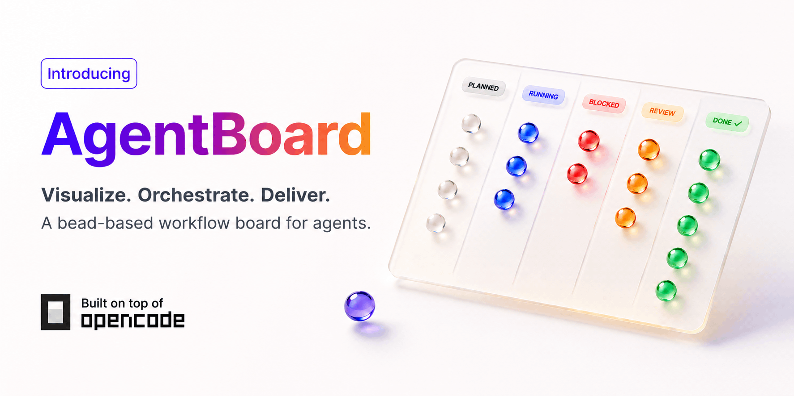
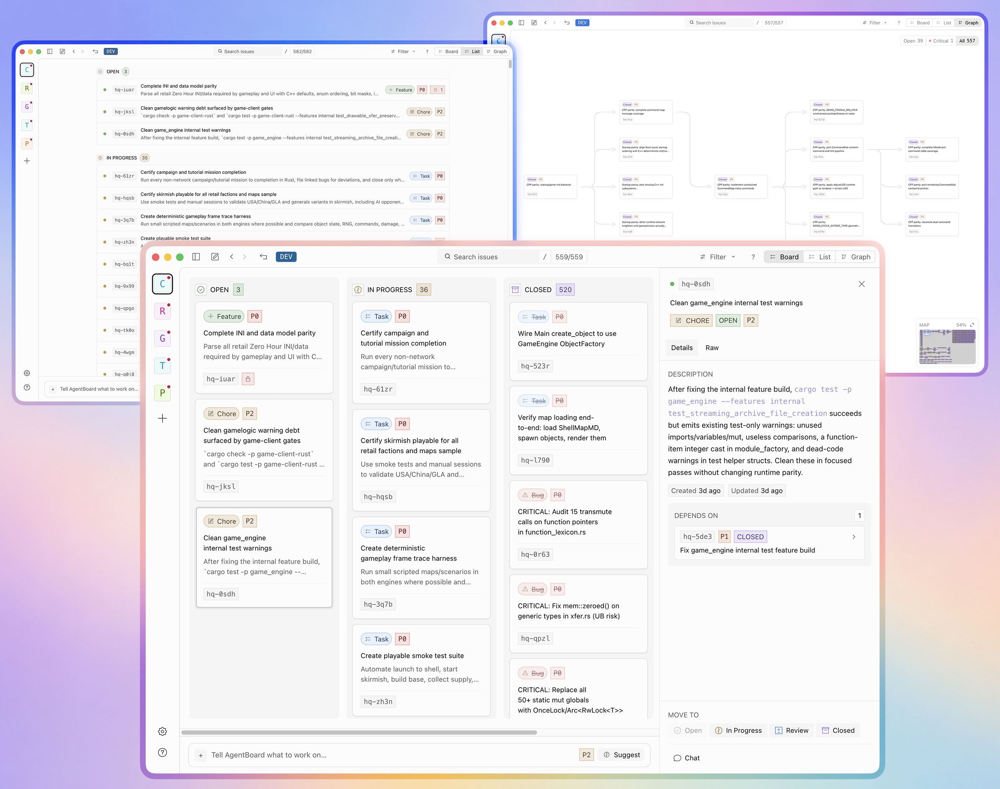
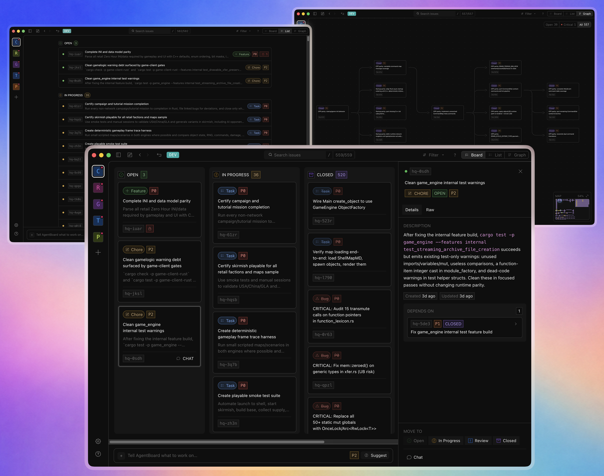

<p align="center">
  
</p>

AgentBoard turns your [Beads](https://github.com/gastownhall/beads) issues into a workspace where you and your coding models can plan, review, and hand off work together.

Instead of scattering tasks across long chat histories, it provides **three synchronized views** of the same local issue graph:

- **Board** — Kanban columns (Open → In Progress → Needs Review → Closed)
- **List** — Fast scanning of large backlogs
- **Graph** — Interactive dependency map with zoom, pan, minimap, and manual layout

Everything stays local. Beads is the single source of truth. Most models already understand it without extra skills.

<p align="center">
  
</p>

## Why AgentBoard

In the last few weeks, OpenAI released [Symphony](https://openai.com/index/introducing-openai-symphony/), [Cursor](https://github.com/cursor/cookbook/tree/main/sdk/agent-kanban) made an example and [Hermes](https://hermes-agent.nousresearch.com/docs/user-guide/features/kanban) shipped their own board. All of them require the agent to learn and maintain a separate orchestration system.

AgentBoard takes a different approach: it reuses [Beads](https://github.com/gastownhall/beads), a lightweight local-first issue tracker that many models already know natively. The UI works inside the [OpenCode](https://github.com/anomalyco/opencode) desktop environment.

No new formats to teach the LLM. No black-box state. If you already use Beads, AgentBoard will already work for you.

## Features

- **Kanban Board** — Drag cards between columns; status updates sync instantly to Beads
- **Interactive Dependency Graph** — Zoom, pan, minimap, filters, and manual node positioning
- **List View** — Scan hundreds of tasks
- **Rich Issue Drawer** — Dependencies, timeline, artifacts, priority, and quick actions
- **One-click Chat Handoff** — Open OpenCode chat with the selected issue pre-attached
- **Inline Issue Creation** — Create tasks from the composer and optionally continue straight into chat
- **Local-first** — Beads database remains the single source of truth for status, priority, and dependencies

## Get Started

Requires [Bun](https://bun.sh) and the Beads `bd` CLI on your PATH.

```bash
git clone https://github.com/bernaferrari/agent-board
cd agent-board
bun install
bun run dev:desktop
```

1. Open your project in the OpenCode desktop app
2. Click **AgentBoard** in the sidebar
3. Initialize Beads with one click (or run `bd init` in your project folder)

**Pro tip:** Run `npx skills beads` to teach any model how to use [Beads](https://github.com/gastownhall/beads).

## Philosophy

This fork was built after studying [OpenAI Symphony](https://openai.com/index/introducing-openai-symphony/), [Cursor's agent Kanban](https://github.com/cursor/cookbook/tree/main/sdk/agent-kanban), and [beads-ui](https://github.com/mantoni/beads-ui). The goal is a lightweight, uncoupled interface that works with any model that already understands Beads, rather than forcing yet another custom system. Although OpenCode is helpful for some chat features, it is easy to extract AgentBoard into its own desktop client or add as part of any existing app/IDE. There are a few styling and UI components being reused from OpenCode, but nothing that can't be easily if needed.

This fork periodically rebases onto upstream OpenCode. Feedback and contributions are welcome.

<p align="center">
  
</p>
