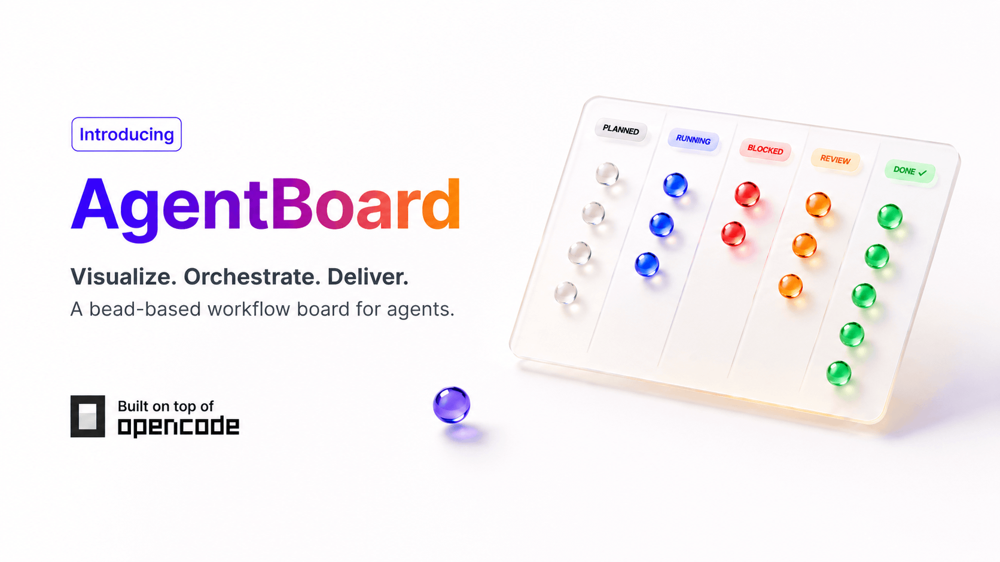

# OpenCode AgentBoard

<p align="center">
  
</p>

<p align="center">
  
  
  
  
</p>

OpenCode AgentBoard is a fork of [OpenCode](https://github.com/anomalyco/opencode) that turns Beads issues into a visual workspace for coding agents: kanban, dependency graph, list view, issue details, and chat handoff in one desktop app.

It is for projects where chat alone is not enough. When work spans many tasks, you need to see what is ready, what is blocked, what needs review, and what a model should pick up next.

> This fork is experimental and is not built by, endorsed by, or affiliated with the OpenCode team.

## Features

- **Kanban board** — Ready, Running, Needs Review, Blocked, and Closed columns backed by Beads
- **Dependency graph** — Zoomable graph with pan, fit, minimap, filters, manual positioning, and readable Beads dependencies
- **List view** — Clean scan mode for quickly reviewing many issues
- **Issue drawer** — Description, priority, status, blockers, timeline, artifacts, created/updated age, and quick transitions
- **Chat handoff** — Open an OpenCode chat with Beads issue context already attached
- **Beads setup flow** — Initialize Beads from the UI or bring your own existing `.beads` database
- **Local-first state** — Beads remains the source of truth for issue content, status, priority, and dependencies

## Run Locally

Requirements:

- [Bun](https://bun.sh)
- Beads `bd` CLI available on `PATH`

```bash
git clone https://github.com/bernaferrari/opencode-agentboard
cd opencode-agentboard
bun install
bun run dev:desktop
```

To hide OpenCode's development performance panel:

```bash
VITE_OPENCODE_DEBUG_BAR=false bun run dev:desktop
```

Then open a project in the desktop app and click **AgentBoard** in the project sidebar. If the project does not have Beads set up yet, click **Initialize Beads**.

You can also initialize Beads manually:

```bash
cd /path/to/your/project
bd init
```

## Why AgentBoard

Coding agents are getting better at doing individual tasks, but humans still need a good way to organize, inspect, and route the work. AgentBoard explores a simple idea: keep issues in a real local tracker, then give the model and the user a visual shared workspace.

Board is good for flow. Graph is good for dependencies. List is good for scanning. Chat is good for execution. AgentBoard puts those modes next to each other so you can choose the view that matches the moment.

## Origin

This started as an experiment after looking at several agent-orchestration interfaces:

- [OpenAI Symphony](https://openai.com/index/open-source-codex-orchestration-symphony/) for orchestration architecture ideas
- Cursor's kanban-style agent workflow and cloud-agent examples
- Beads UI for what a Beads-native interface already did well and where it felt different
- OpenCode for the desktop shell, project model, and chat runtime

The rough prompt was: build a Symphony-inspired backend and Cursor-inspired UI on top of OpenCode, using Beads as the issue substrate. After that, the app was iterated manually with Codex: first board, then graph, then list, with a lot of UI and interaction tuning.

## Relationship To OpenCode

This repository is a fork of [anomalyco/opencode](https://github.com/anomalyco/opencode). It keeps OpenCode's desktop shell and chat experience, then adds AgentBoard as an experiment on top.

Upstream OpenCode:

- Website: [opencode.ai](https://opencode.ai)
- GitHub: [github.com/anomalyco/opencode](https://github.com/anomalyco/opencode)
- Docs: [opencode.ai/docs](https://opencode.ai/docs)

## Status

Experimental preview. The core desktop loop works today: open a project, initialize Beads, create issues, move through board/list/graph, and hand work to chat. Graph layout and deeper automation are still evolving.

## License

MIT. See [LICENSE](./LICENSE).
